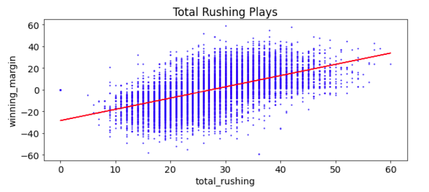
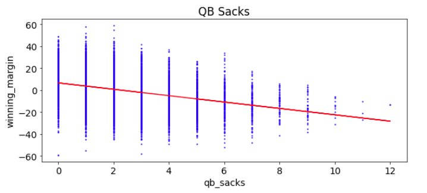
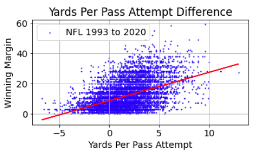

# Python Pandas and Matplotlib Examples
Using historical NFL data to illustrate the main topics discussed in Module 4 and 5 of the UC Berkeley Extension Data Visualization and Data Analysis class. The included notebooks show importing CSV data with Pandas, managing the data, drawing plots. Plots like these:

 

I am the currator of a database of NFL game data, which I started in 1993, for BudGoodeSports.com. Now I have 27 years worth of the data, over 14,600 games, 72 variables per game, in a MySQL database. Can this data be mined to gather information or insight into what makes a team win?

I thought it might be fun to take the class through this data and make some plots and perform some analysis as covered in modules 4 and 5. I may also revisit this dataset in module 15 - Statistics and R.

## Background
Since 1988 I've been in a project involving NFL statistics. Bud Goode was a pioneer in sports statistics, going all the way back to 1960 and crunching game data with a mainframe computer the size of a large room. He died in 2010 at the age of 88. But from 1988 to 2010 I helped him retrieve the data weekly from the NFL servers, crunch the data, and send out weekly reports to several NFL teams. These reports included advice to the coaches from the statistical point of view. 

I am not really a sports fan (sorry) but I am attracted to the statistics and data visualization aspect. This is a work in progress and I am hoping in the near future to munge this database and maybe make something of interest to the sports-stats loving public.

Here is a picture of Bud Goode with his friend Adam West (Bud is on the right). Adam West played Batman on TV in the 1960s, but this picture was from before that...

I followed the general topics of Module 4 and 5 and created some Jupyter notebook examples showing how to import some NFL data from a CSV file, clean the data, draw plots, see trends.

The CSV file used on this project was created by picking a few choice variables from my MySQL database, spanning 27 years.

## nfl_stats1.ipynb

This notebook contains examples cover the following:

1. Read in a CSV file into a Pandas DataFrame
2. Clean the data
3. Draw some plots
4. Draw trend lines on the plots.

## nfl_stats2.ipynb

This notebook contains examples cover the following:

1. Read in a CSV file into a Pandas DataFrame
2. Creating functions to clean the data and draw plots. This makes the code cleaner.
3. Draw scatter plots and bxx plots.

 

## nfl_stats3.ipynb

This notebook contains examples cover the following:

1. Read in a CSV file into a Pandas DataFrame
2. Import and clean the data
3. Create a function extract a DataFrame based on the team, year
4. Create a line plot with 2 valiables from the extracted data for one year, one team.

 
